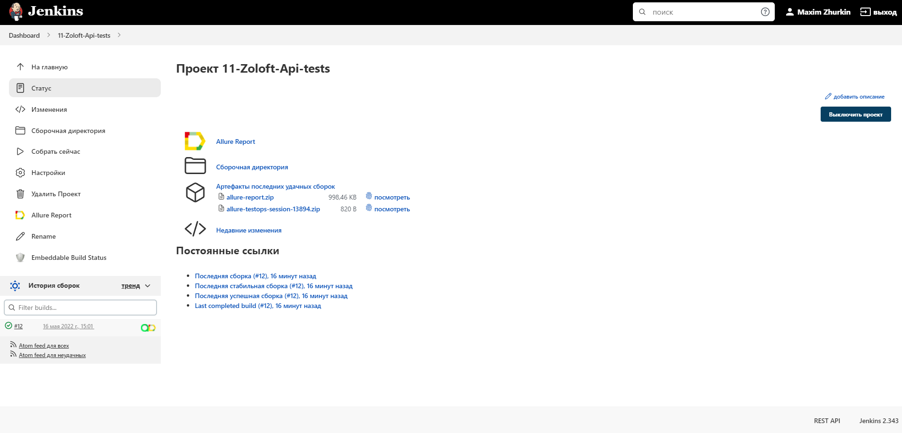
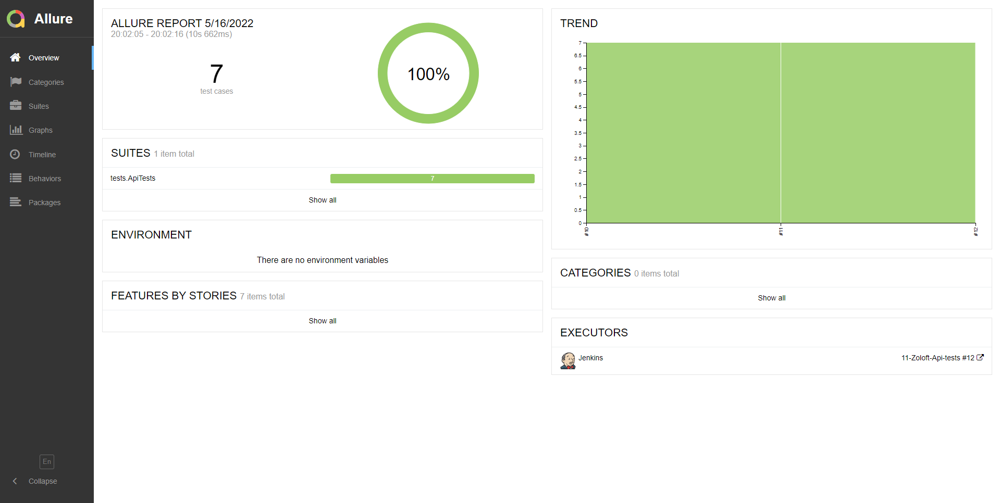
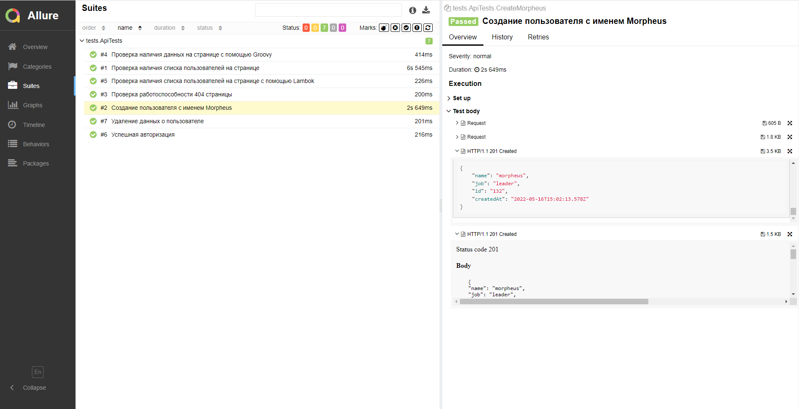
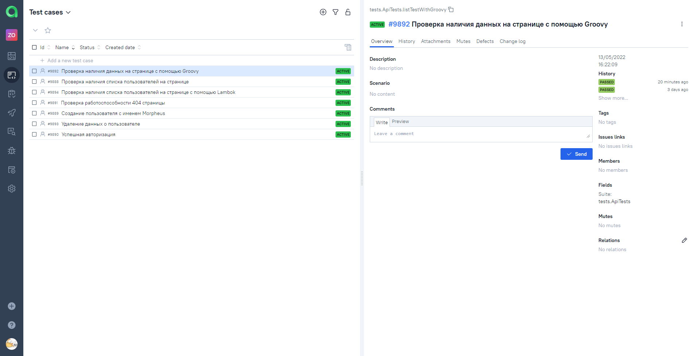
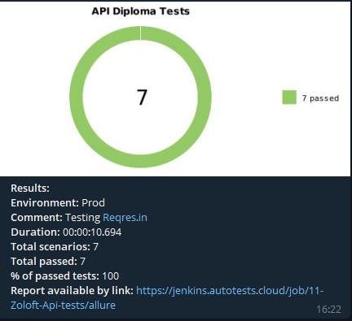

# Проект API автоматизации для сайта <a href="https://reqres.in/">reqres.in</a>

## :point_up: Структура:

- <a href="#point_up_2-стек">Стек</a>
- <a href="#point_up_2-проведенные автотесты">Проведенные автотесты</a>
- <a href="#point_up_2-сборка-в-Jenkins">Сборка в Jenkins</a>
- <a href="#point_up_2-allure-отчет">Allure отчет</a>
- <a href="#point_up_2-интеграция-с-allure-testops">Интеграция с Allure TestOps</a>
- <a href="#point_up_2-интеграция-с-jira">Интеграция с Jira</a>
- <a href="#point_up_2-отчет-в-telegram">Отчет в Telegram</a>

## :point_up_2: Стек

## :point_up_2: Проведенные автотесты
- Проверка наличия списка пользователей на странице с помощью Lambok
- Создание пользователя с именем Morpheus с помощью Lambok
- Проверка наличия данных на странице с помощью Groovy
- Проверка работоспособности 404 страницы
- Проверка авторизации
- Проверка наличия списка пользователей на странице
- Удаление данных о пользователе

## :point_up_2: Сборка в Jenkins
### <a target="_blank" href="https://jenkins.autotests.cloud/job/11-Zoloft-Api-tests/">Сборка в Jenkins</a>

## :point_up_2: Allure отчет
- ### Главный экран отчета

- ### Страница с проведенными тестами

## :point_up_2: Интеграция с Allure TestOps
- ### Экран с результатами запуска тестов

- ### Страница с тестами в TestOps

## :point_up_2: Отчет в Telegram

